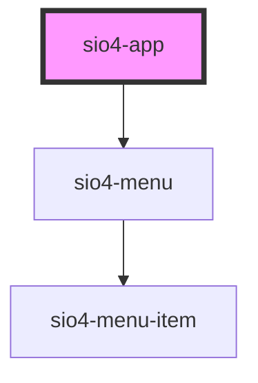

# sio4-app

<!-- Auto Generated Below -->

## Properties

| Property   | Attribute  | Description | Type                                                                                                                                             | Default         |
| ---------- | ---------- | ----------- | ------------------------------------------------------------------------------------------------------------------------------------------------ | --------------- |
| `appname`  | `appname`  |             | `string`                                                                                                                                         | `'SILICIA APP'` |
| `color`    | `color`    |             | `"danger" \| "dark" \| "light" \| "medium" \| "primary" \| "secondary" \| "success" \| "tertiary" \| "warning" \| string & Record<never, never>` | `undefined`     |
| `menu`     | --         |             | `Sio4MenuInterface`                                                                                                                              | `undefined`     |
| `sidemenu` | `sidemenu` |             | `"none" \| "overlay" \| "push" \| "reveal" \| "toogle"`                                                                                          | `'none'`        |
| `tab`      | `tab`      |             | `"bottom" \| "none" \| "side" \| "top"`                                                                                                          | `'none'`        |

## Events

| Event                   | Description | Type                                 |
| ----------------------- | ----------- | ------------------------------------ |
| `sio4SplitPanelVisible` |             | `CustomEvent<{ visible: boolean; }>` |

## Dependencies

### Depends on

- [sio4-menu](../menu)

### Graph

----------------------------------------------

*Built with [StencilJS](https://stenciljs.com/)*
