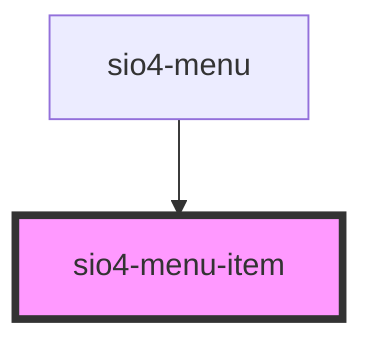

# sio4-menu-item

<!-- Auto Generated Below -->

## Properties

| Property     | Attribute      | Description                                       | Type                       | Default      |
| ------------ | -------------- | ------------------------------------------------- | -------------------------- | ------------ |
| `badge`      | `badge`        |                                                   | `number`                   | `0`          |
| `caption`    | `caption`      |                                                   | `string`                   | `undefined`  |
| `disabled`   | `disabled`     |                                                   | `boolean`                  | `false`      |
| `icon`       | `icon`         |                                                   | `string`                   | `undefined`  |
| `layout`     | `layout`       |                                                   | `string`                   | `undefined`  |
| `menuItemId` | `menu-item-id` |                                                   | `number`                   | `undefined`  |
| `mode`       | `mode`         | The mode determines which platform styles to use. | `"ios" \| "md"`            | `undefined`  |
| `styleMenu`  | `style-menu`   |                                                   | `string`                   | `'rounded'`  |
| `tabbed`     | `tabbed`       |                                                   | `boolean`                  | `false`      |
| `type`       | `type`         |                                                   | `"download" \| "navigate"` | `'navigate'` |
| `url`        | `url`          |                                                   | `string`                   | `'/'`        |

## Slots

| Slot      | Description                                                           |
| --------- | --------------------------------------------------------------------- |
|           | Content is placed between the named slots if provided without a slot. |
| `"end"`   | Content is placed to the right of the item.                           |
| `"start"` | Content is placed to the left of the item.                            |

## Dependencies

### Used by

 - [sio4-menu](../menu)

### Graph

----------------------------------------------

*Built with [StencilJS](https://stenciljs.com/)*
