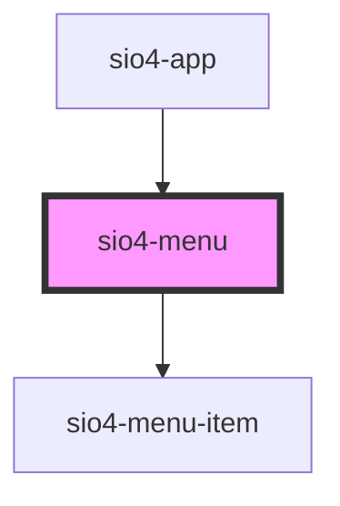

# sio4-menu

<!-- Auto Generated Below -->

## Properties

| Property         | Attribute          | Description | Type                           | Default      |
| ---------------- | ------------------ | ----------- | ------------------------------ | ------------ |
| `color`          | `color`            |             | `string`                       | `undefined`  |
| `enabled`        | `enabled`          |             | `boolean`                      | `false`      |
| `label`          | `label`            |             | `string`                       | `'NO LABEL'` |
| `layout`         | `layout`           |             | `"accordion" \| "flat"`        | `'flat'`     |
| `lines`          | `lines`            |             | `"full" \| "inset" \| "none"`  | `'none'`     |
| `menuId`         | `menu-id`          |             | `string`                       | `'main'`     |
| `menuItems`      | --                 |             | `Sio4CoreMenuItemInterface[]`  | `undefined`  |
| `position`       | `position`         |             | `"bottom" \| "hover" \| "top"` | `'hover'`    |
| `toggleIcon`     | `toggle-icon`      |             | `string`                       | `''`         |
| `toggleIconSlot` | `toggle-icon-slot` |             | `"end" \| "start"`             | `'start'`    |

## Dependencies

### Used by

 - [sio4-app](../app)

### Depends on

- [sio4-menu-item](../menu-item)

### Graph

----------------------------------------------

*Built with [StencilJS](https://stenciljs.com/)*
