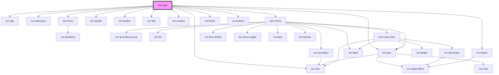

# sio4-app

<!-- Auto Generated Below -->

## Properties

| Property   | Attribute  | Description | Type                                             | Default         |
| ---------- | ---------- | ----------- | ------------------------------------------------ | --------------- |
| `atitle`   | `atitle`   |             | `string`                                         | `'SILICIA APP'` |
| `color`    | `color`    |             | `string`                                         | `undefined`     |
| `menu`     | --         |             | `Sio4MenuInterface`                              | `undefined`     |
| `sidemenu` | `sidemenu` |             | `"lg" \| "md" \| "none" \| "sm" \| "xl" \| "xs"` | `'none'`        |

## Dependencies

### Depends on

- ion-app
- ion-split-pane
- ion-menu
- ion-header
- ion-toolbar
- ion-title
- ion-content
- [sio4-menu](../sio4-menu)
- ion-item
- ion-footer
- ion-buttons
- ion-button
- ion-icon

### Graph

----------------------------------------------

*Built with [StencilJS](https://stenciljs.com/)*
